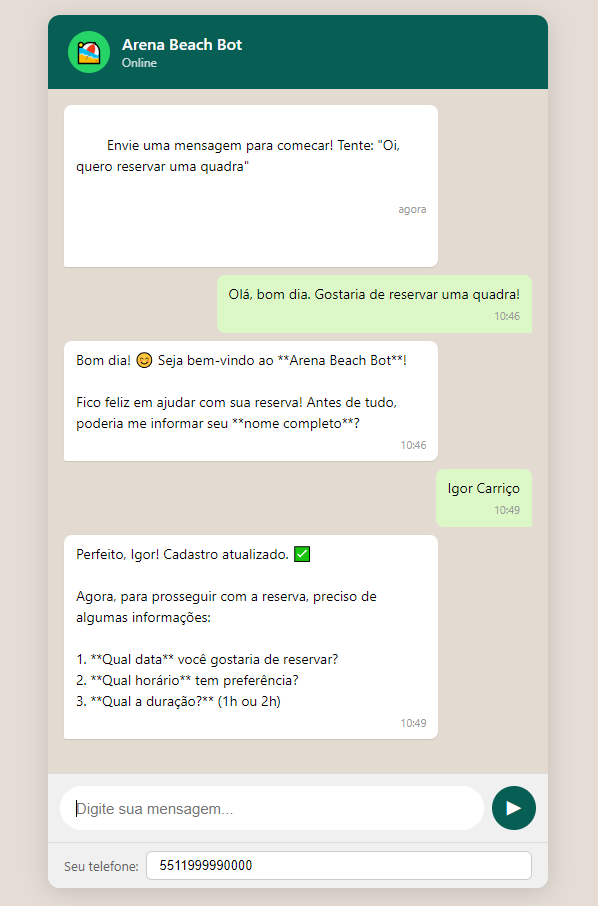

# WhatsApp Booking Bot

**Chatbot inteligente para reservas de quadras de areia via WhatsApp**, powered by Claude AI (Anthropic).

[](https://whatsapp-booking-bot-apgn.onrender.com)




---

## O que este projeto faz?

Um centro esportivo com quadras de areia recebe dezenas de mensagens por dia no WhatsApp: reservas, cancelamentos, dúvidas sobre horários e preços. Hoje, uma pessoa faz esse atendimento manualmente.

Este bot automatiza esse fluxo com IA. O aluno conversa naturalmente pelo WhatsApp e o bot:

- Consulta disponibilidade em tempo real
- Faz reservas com validação completa (conflitos, horários, duração)
- Cancela e reagenda reservas
- Responde dúvidas sobre o centro (preços, horários, regras, equipamentos)
- Escala para um atendente humano quando necessário

### Teste agora

**[Clique aqui para testar a demo online](https://whatsapp-booking-bot-apgn.onrender.com)** (pode levar ~30s para acordar na primeira vez)

Experimente mensagens como:
- `Oi, quero reservar uma quadra`
- `Qual o horário de funcionamento?`
- `Vocês tem bola e raquete?`
- `Quero cancelar minha reserva`

---

## Decisão de Arquitetura

### Por que Claude API com Tool Use (e não agentes)?

O domínio é bem delimitado: reservar, cancelar, reagendar, consultar. As ações são previsíveis e finitas. Usar agentes autônomos adicionaria complexidade, latência e custo sem ganho proporcional.

A abordagem escolhida:
- **Claude interpreta** a intenção e extrai entidades (data, horário, quadra)
- **Tools executam** lógica de negócio determinística (sem alucinação)
- **Loop simples:** mensagem → Claude → tool call → resultado → Claude → resposta

```
┌─────────────┐     ┌──────────────┐     ┌───────────────┐     ┌──────────┐
│  WhatsApp   │────▶│   Webhook    │────▶│   Assistant    │────▶│  Claude  │
│  Business   │◀────│  (Fastify)   │◀────│  (Tool Loop)  │◀────│   API    │
│  Cloud API  │     └──────────────┘     └───────┬───────┘     └──────────┘
└─────────────┘                                  │
                                          ┌──────┴──────┐
                                          │    Tools    │
                                          │  (8 funcs)  │
                                          └──────┬──────┘
                                                 │
                                    ┌────────────┼────────────┐
                                    │            │            │
                              ┌─────┴──┐  ┌─────┴───┐  ┌────┴─────┐
                              │Student │  │Reserva- │  │  Court   │
                              │Service │  │tion Svc │  │ Service  │
                              └────┬───┘  └────┬────┘  └────┬─────┘
                                   └────────────┼────────────┘
                                         ┌──────┴──────┐
                                         │   SQLite    │
                                         └─────────────┘
```

### As 8 ferramentas do bot

| Ferramenta | O que faz |
|-----------|-----------|
| `consultar_disponibilidade` | Verifica slots livres por data/quadra |
| `fazer_reserva` | Cria reserva com validação completa |
| `cancelar_reserva` | Cancela com verificação de prazo (2h antes) |
| `reagendar_reserva` | Cancela + recria (transacional) |
| `minhas_reservas` | Lista reservas do aluno |
| `sugerir_alternativas` | Sugere horários próximos ao desejado |
| `atualizar_cadastro` | Salva nome do aluno |
| `escalar_para_humano` | Handoff para atendente |

---

## Fluxos de Conversa

### Reserva completa
```
Aluno: Oi, quero reservar uma quadra
Bot:   Olá! Seja bem-vindo ao Arena Beach Bot! Qual é o seu nome?
Aluno: João Silva
Bot:   Prazer, João! Para qual data e horário você gostaria de reservar?
Aluno: Amanhã às 18h, 1 hora
Bot:   Encontrei disponibilidade para amanhã às 18h:
       • Beach 1 • Beach 2 • Beach 3 • Beach 4
       Qual quadra você prefere?
Aluno: Beach 1
Bot:   Confirmo a reserva:
       📋 Beach 1 | 08/04 | 18:00–19:00 | 1h | R$ 120,00
       Posso confirmar?
Aluno: Sim!
Bot:   Reserva confirmada! ✅ ID: #1 | Beach 1 | 08/04 às 18:00-19:00
```

### Conflito de horário
```
Aluno: Quero reservar a Beach 1 amanhã às 18h
Bot:   A Beach 1 está ocupada nesse horário.
       Alternativas próximas:
       • Beach 2 às 18:00
       • Beach 1 às 17:00
       • Beach 1 às 19:00
       Alguma dessas funciona?
```

### Cancelamento
```
Aluno: Preciso cancelar minha reserva
Bot:   Suas reservas ativas:
       1. #1 — Beach 1 | 08/04 | 18:00-19:00
       Confirmo o cancelamento?
Aluno: Sim
Bot:   Reserva #1 cancelada com sucesso. ✅
```

---

## Validações implementadas

- Horário dentro do funcionamento (06:00–22:00)
- Duração entre 1h e 2h
- Conflito de horário na mesma quadra (impede dupla reserva)
- Cancelamento apenas até 2h antes do horário
- Apenas o dono pode cancelar/reagendar sua reserva
- Identificação automática do aluno por telefone
- Confirmação obrigatória antes de ações críticas
- Interpretação de datas relativas ("amanhã", "sexta")
- Sugestão de alternativas quando horário indisponível

---

## Estrutura do Projeto

```
src/
├── config.ts                    # Configuração centralizada (Zod)
├── env.ts                       # Carregamento do .env
├── logger.ts                    # Logger (Pino)
├── index.ts                     # Entry point + seed automático
├── server.ts                    # Servidor Fastify
├── domain/
│   └── rules.ts                 # Tipos, regras de negócio, validações puras
├── database/
│   ├── schema.ts                # Documentação do schema
│   ├── connection.ts            # SQLite (sql.js) + helpers de query
│   └── seed.ts                  # Dados iniciais
├── services/
│   ├── student.service.ts       # CRUD de alunos
│   ├── court.service.ts         # Consulta de quadras
│   ├── reservation.service.ts   # Lógica de reservas (core)
│   └── conversation.service.ts  # Log de conversas
├── ai/
│   ├── system-prompt.ts         # System prompt com contexto dinâmico
│   ├── tools.ts                 # Definição das 8 ferramentas (JSON Schema)
│   ├── tool-handlers.ts         # Execução das ferramentas
│   └── assistant.ts             # Orquestrador (loop de tool use + memória)
└── whatsapp/
    ├── types.ts                 # Tipos da WhatsApp Cloud API
    ├── client.ts                # Cliente para envio de mensagens
    └── webhook.ts               # Webhook + endpoint /chat + /admin
```

---

## Como rodar localmente

### Pré-requisitos
- Node.js 20+
- Chave de API da [Anthropic](https://console.anthropic.com)

### Instalação

```bash
git clone https://github.com/igorcarrico/whatsapp-booking-bot.git
cd whatsapp-booking-bot

npm install

cp .env.example .env
# Edite o .env e adicione sua ANTHROPIC_API_KEY

npm run seed
npm run dev
```

Acesse **http://localhost:3000** para a interface de chat.

### Testes

```bash
npm test   # 25 testes (regras de domínio, serviços, conflitos)
```

---

## Integração com WhatsApp

A arquitetura já está pronta para conectar com a **WhatsApp Business Cloud API** (Meta).

### Configuração

1. Crie um App em [developers.facebook.com](https://developers.facebook.com) (tipo Business)
2. Adicione o produto WhatsApp e obtenha o Access Token e Phone Number ID
3. Configure o webhook apontando para `https://seu-dominio/webhook`
4. Adicione as variáveis no `.env`:

```env
WHATSAPP_VERIFY_TOKEN=seu_token
WHATSAPP_ACCESS_TOKEN=seu_access_token
WHATSAPP_PHONE_NUMBER_ID=seu_phone_number_id
```

---

## Stack

| Tecnologia | Uso |
|-----------|-----|
| **TypeScript** | Linguagem principal |
| **Fastify** | Servidor HTTP (webhooks + API) |
| **Claude API** | NLU + Tool Use (Anthropic) |
| **SQLite (sql.js)** | Banco de dados (WASM, sem dependência nativa) |
| **Pino** | Logging estruturado |
| **Zod** | Validação de configuração |
| **Vitest** | Testes |
| **date-fns** | Manipulação de datas + fuso horário |

---

## Configuração do Centro Esportivo

| Variável | Padrão | Descrição |
|----------|--------|-----------|
| `CENTER_NAME` | Arena Beach | Nome do centro |
| `CENTER_ADDRESS` | Rua das Quadras, 100 - São Paulo/SP | Endereço |
| `CENTER_PHONE` | (11) 99999-0000 | Telefone |
| `CENTER_OPEN_TIME` | 06:00 | Abertura |
| `CENTER_CLOSE_TIME` | 22:00 | Fechamento |
| `CENTER_PRICE_PER_HOUR` | 120 | Preço por hora (R$) |

---

## Limitações e Próximos Passos

### Limitações atuais
- Apenas mensagens de texto (áudio/imagem ignorados)
- Sem pagamento online (pagamento presencial)
- Sem reservas recorrentes ("todo sábado às 10h")
- Sem painel administrativo web

### Roadmap
1. **Painel admin web** — React/Next.js para gestão
2. **Pagamento online** — Stripe ou Mercado Pago
3. **Notificações** — Lembretes automáticos antes da reserva
4. **Reservas recorrentes** — Agendamento semanal fixo
5. **Mensagens de áudio** — Transcrição com Whisper
6. **Multi-tenant** — Suporte a múltiplos centros esportivos
7. **Métricas** — Dashboard de ocupação e horários de pico
